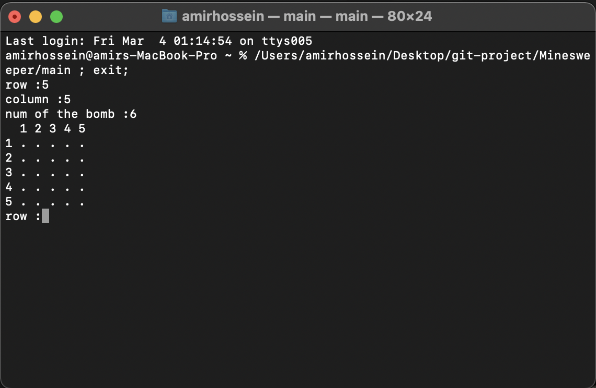
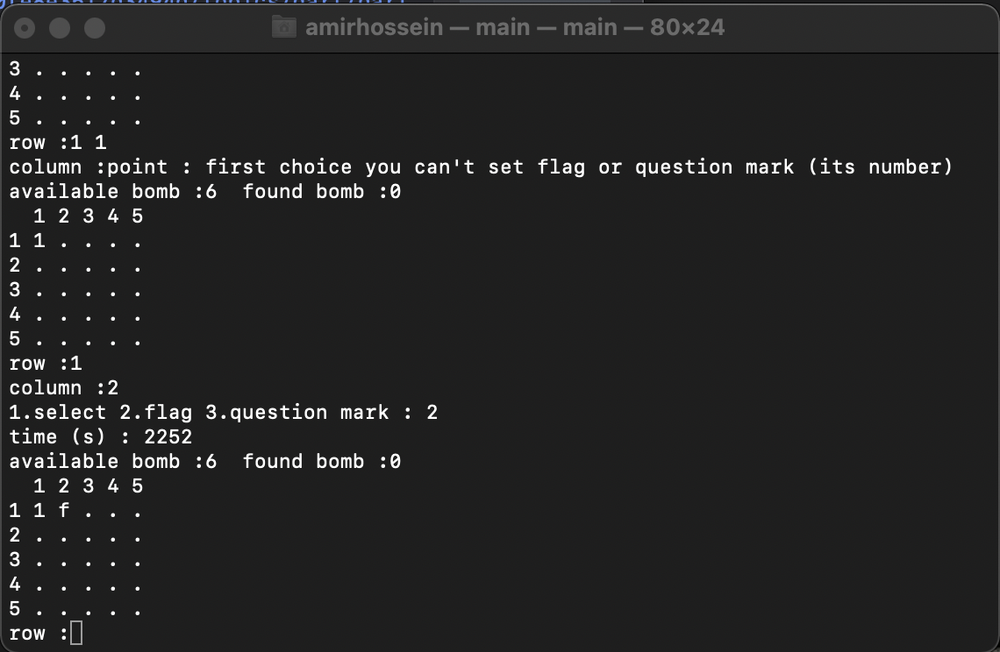

# Minesweeper
In this project , I intended to implement the minesweeper game. 
For this project first you need to install c++ compiler. Then you can clone this repository and run the project. 
After you run the project you should enter the row and column and number of bomb then you can see the board and you should find all bombs. 
 

 
As you can see in the image above, the game board is open for you and you have to find the location of the bombs by selecting the column and row. You can also use the flag (indicating that the bomb is here) and the question mark (houses That you doubt) use.
 
 

